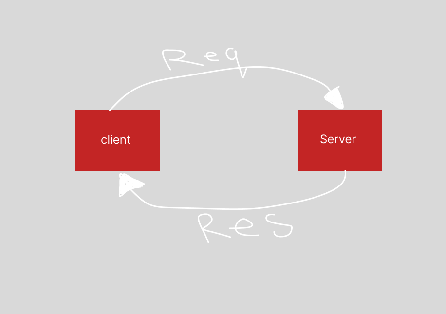
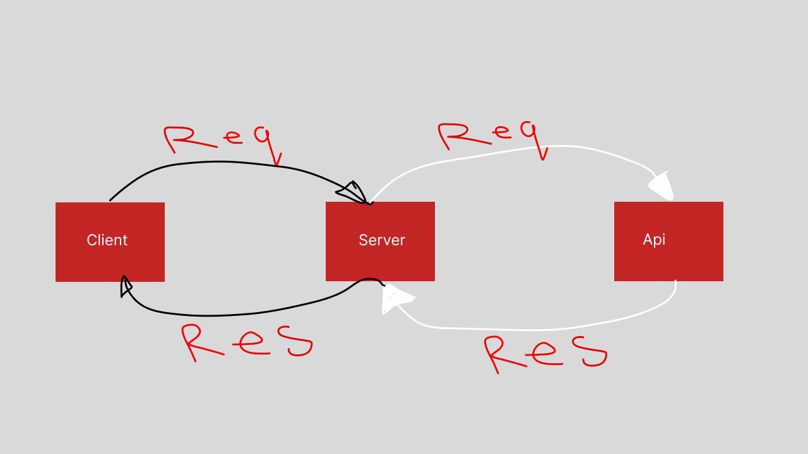
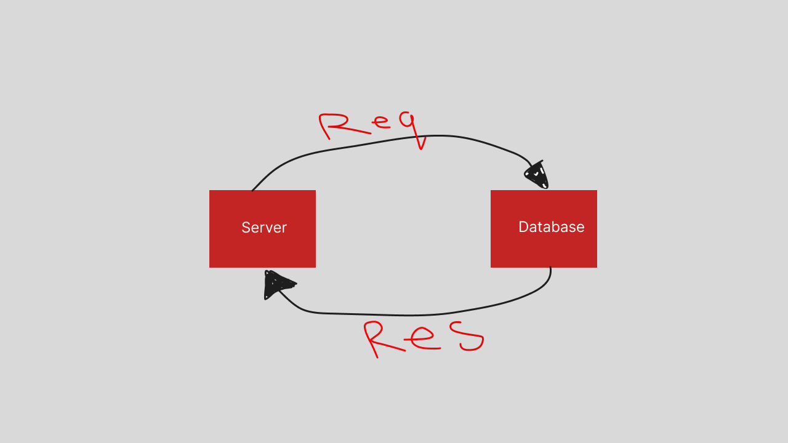

# Movies Library

**Author Name**: Amjad Khaled Al-Sayyed

## Deployed Link

movies-library-production-9d90.up.railway.app

## Routes

### API routes

1. Method :get ENDPoint : "/trending"
2. Method :get ENDPoint :"/search"
3. Method :get ENDPoint :"/genre"
4. Method :get ENDPoint :"/person"

### DataBase Routrs

1. Method :get ENDPoint :"/getMovie"
2. Method :post ENDPoint :"/getMovie"
3. Method :get ENDPoint :"/getMovie/:id"
4. Method :put ENDPoint :"/updateMovie/:id"
5. Method :delete ENDPoint :"/deleteMovie/:id"

## WRRC

### lab11

### lab12

### lab13

## Overview

## Getting Started

### To run this in your machine

1. clone the repository then run _npm install_ in your terminal after opening the directory (make sure to navigate to myServer directory)

2. type _nodemon_ in the terminal to run your server.

3. you need to install postgressql database in your machine.

4. create a database to link it with the project .

5. you need to change the name in the database link to the new database name to link it .

6. run your sql database .

7. then try the routs in the thunder or the postmen.

## Project Features

1. You can accses some Endpoints from the Movie DB API .

2. YOu can create , read , update and delete from the dataBase using routes .
